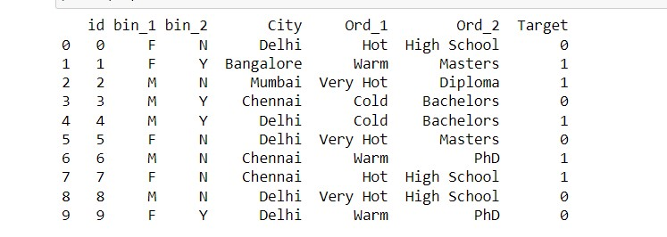
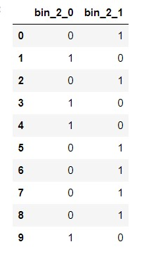
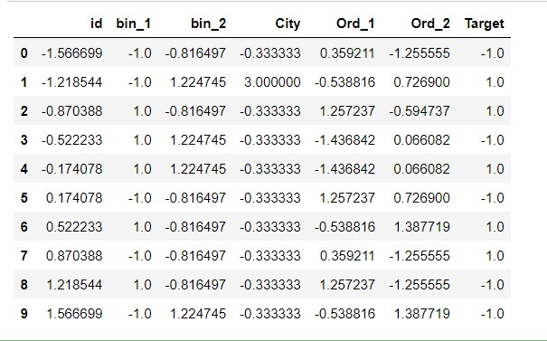
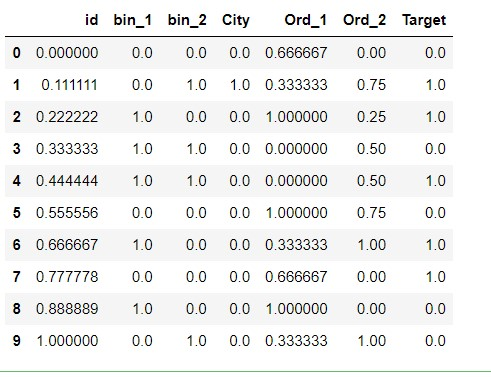
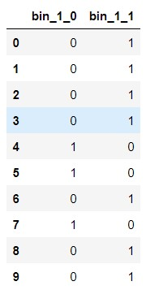
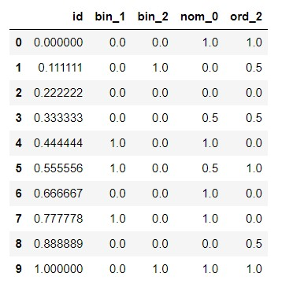
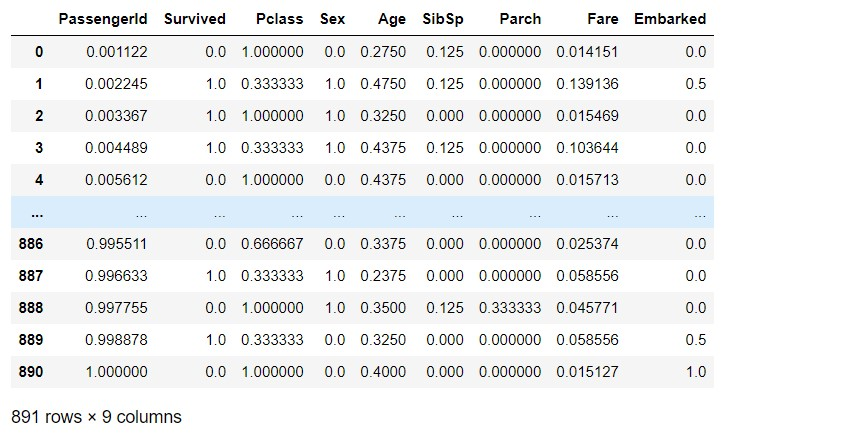

# EX-05-Feature-Generation


# AIM:
To read the given data and perform Feature Generation process and save the data to a file. 

# Explanation:
Feature Generation (also known as feature construction, feature extraction or feature engineering) is the process of transforming features into new features that better relate to the target.
 

# ALGORITHM:
### STEP 1:
Read the given Data.
### STEP 2:
Clean the Data Set using Data Cleaning Process.
### STEP 3:
Apply Feature Generation techniques to all the feature of the data set.
### STEP 4:
Save the data to the file.


# CODE:
## data:
```python
import pandas as pd
df=pd.read_csv("data.csv")
print(df)
import category_encoders as ce
be=ce.BinaryEncoder()
df1=be.fit_transform(df["bin_1"])
df["bin_1"] = be.fit_transform(df["bin_1"])
df1
be=ce.BinaryEncoder()
df2=be.fit_transform(df["bin_2"])
df["bin_2"] = be.fit_transform(df["bin_2"])
df2
df1=df.copy()
from sklearn.preprocessing import LabelEncoder,OrdinalEncoder,OneHotEncoder
import category_encoders as ce
be=ce.BinaryEncoder()
ohe=OneHotEncoder(sparse=False)
le=LabelEncoder()
oe=OrdinalEncoder()
df1["City"] = ohe.fit_transform(df1[["City"]])
temp=['Cold','Warm','Hot','Very Hot']
oe1=OrdinalEncoder(categories=[temp])
df1['Ord_1'] = oe1.fit_transform(df1[["Ord_1"]])
edu=['High School','Diploma','Bachelors','Masters','PhD']
oe2=OrdinalEncoder(categories=[edu])
df1['Ord_2']= oe2.fit_transform(df1[["Ord_2"]])
df1
## SCALING:
from sklearn.preprocessing import MinMaxScaler
sc=MinMaxScaler()
df2=pd.DataFrame(sc.fit_transform(df1),columns=(['id', 'bin_1', 'bin_2', 'City', 'Ord_1','Ord_2','Target']))
df2
from sklearn.preprocessing import StandardScaler
sc1=StandardScaler()
df3=pd.DataFrame(sc1.fit_transform(df1),columns=['id', 'bin_1', 'bin_2', 'City', 'Ord_1','Ord_2','Target'])
df3
from sklearn.preprocessing import MaxAbsScaler
sc2=MaxAbsScaler()
df4=pd.DataFrame(sc2.fit_transform(df1),columns=['id', 'bin_1', 'bin_2', 'City', 'Ord_1','Ord_2','Target'])
df4
from sklearn.preprocessing import RobustScaler
sc3=RobustScaler()
df5=pd.DataFrame(sc3.fit_transform(df1),columns=['id', 'bin_1', 'bin_2', 'City', 'Ord_1','Ord_2','Target'])
df5

```
## Encoding Data:
```python
import pandas as pd
df=pd.read_csv("Encoding Data.csv")
df
## GENERATION
import category_encoders as ce
be=ce.BinaryEncoder()
ndf=be.fit_transform(df["bin_1"])
df["bin_1"] = be.fit_transform(df["bin_1"])
ndf
be=ce.BinaryEncoder()
ndf2=be.fit_transform(df["bin_2"])
df["bin_2"] = be.fit_transform(df["bin_2"])
ndf2
df1=df.copy()
from sklearn.preprocessing import LabelEncoder,OrdinalEncoder
le=LabelEncoder()
oe=OrdinalEncoder()
df1["nom_0"] = oe.fit_transform(df1[["nom_0"]])
temp=['Cold','Warm','Hot']
oe2=OrdinalEncoder(categories=[temp])
df1['ord_2'] = oe2.fit_transform(df1[['ord_2']])
df1
## SCALING:
from sklearn.preprocessing import MinMaxScaler
sc=MinMaxScaler()
df0=pd.DataFrame(sc.fit_transform(df1),columns=['id', 'bin_1', 'bin_2', 'nom_0','ord_2'])
df0
from sklearn.preprocessing import StandardScaler
sc1=StandardScaler()
df2=pd.DataFrame(sc1.fit_transform(df1),columns=['id', 'bin_1', 'bin_2', 'nom_0','ord_2'])
df2
from sklearn.preprocessing import MaxAbsScaler
sc2=MaxAbsScaler()
df3=pd.DataFrame(sc2.fit_transform(df1),columns=['id', 'bin_1', 'bin_2', 'nom_0','ord_2'])
df3
from sklearn.preprocessing import RobustScaler
sc3=RobustScaler()
df4=pd.DataFrame(sc3.fit_transform(df1),columns=['id', 'bin_1', 'bin_2', 'nom_0','ord_2'])
df4

```
## Titanic_dataset:
```python
import pandas as pd
df=pd.read_csv("titanic_dataset.csv")
df
df.drop("Name",axis=1,inplace=True)
df.drop("Ticket",axis=1,inplace=True)
df.drop("Cabin",axis=1,inplace=True)
df.isnull().sum()

df["Age"]=df["Age"].fillna(df["Age"].median())
df["Embarked"]=df["Embarked"].fillna(df["Embarked"].mode()[0])
df.isnull().sum()
df
## ENCODING
import category_encoders as ce
be=ce.BinaryEncoder()
ndf=be.fit_transform(df['Sex'])
ndf
df1=df.copy()
from sklearn.preprocessing import LabelEncoder, OrdinalEncoder
embark=['S','C','Q']
e1=OrdinalEncoder(categories=[embark])
df1['Embarked'] = e1.fit_transform(df[['Embarked']])
df1

## SCALING
from sklearn.preprocessing import MinMaxScaler
sc=MinMaxScaler()
df0=pd.DataFrame(sc.fit_transform(df1),columns=['PassengerId', 'Survived', 'Pclass', 'Sex','Age','SibSp','Parch','Fare','Embarked'])
df0
from sklearn.preprocessing import StandardScaler
sc1=StandardScaler()
df2=pd.DataFrame(sc1.fit_transform(df1),columns=['PassengerId', 'Survived', 'Pclass', 'Sex','Age','SibSp','Parch','Fare','Embarked'])
df2
from sklearn.preprocessing import MaxAbsScaler
sc2=MaxAbsScaler()
df3=pd.DataFrame(sc2.fit_transform(df1),columns=['PassengerId', 'Survived', 'Pclass', 'Sex','Age','SibSp','Parch','Fare','Embarked'])
df3
from sklearn.preprocessing import RobustScaler
sc3=RobustScaler()
df4=pd.DataFrame(sc3.fit_transform(df1),columns=['PassengerId', 'Survived', 'Pclass', 'Sex','Age','SibSp','Parch','Fare','Embarked'])
df4

```
# OUTPUT:
## i) data.csv :





Minmax scaling:


Standard Scaling:



MaxAbs Scaling:



Robust Scaling:


## ii) Encoding data.csv:




Min Max Scaler:



Standard Scaler:


 Max Abs Scaler:


Robust Scaler:


## iii) Titanic_dataset.csv:


Removing Null Values:


Encoding:


Min Max Scaler:


Standard Scaler:


Max Abs Scaler:



Robust Scaler:


# RESULT:
 Thus the Feature Generation and Feature Scaling process is applied to the given data set.